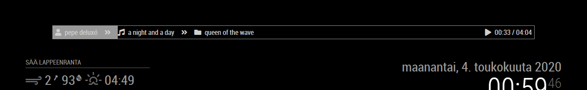

# MMM-NowPlayingOnAIMP

`MMM-NowPlayingOnAIMP` is a module for [MagicMirror](https://github.com/MichMich/MagicMirror) that allows you to show the currently playing song on [AIMP](https://aimp.ru). This module has been designed to be positioned to top or bottom bar, it probably won't be very usable in other regions.



### Prerequisites

This module requires that you have [Aimp-control-plugin](http://a0ivanov.github.io/aimp-control-plugin/) installed to your AIMP.
Also ensure that you don't have a firewall blocking access to the RPC service created by the plugin (port 3333 by default).

### Setup

Clone this module into your MagicMirror's `modules` directory and install the dependencies:

```sh
cd modules
git clone https://github.com/jesmak/MMM-MMM-NowPlayingOnAIMP
cd MMM-MMM-NowPlayingOnAIMP
npm install
```

then add the module to your MagicMirror's configuration. Here is an example:

```javascript
/* MagicMirror/config/config.js */
{
    /* ...your other config here */

    modules: [

        /* ...your other modules here */

        {
            module: 'MMM-NowPlayingOnAIMP',
            position: 'top_bar',
            config: {
                aimpUrl: Url
            }
        }
    ]
}
```

### Configuration options

| Configuration key | Description | Default | Required |
| --- | --- | --- | --- |
| aimpUrl | URL of the AIMP Control Plugin RPC service, E.g. `http://10.0.1.50:3333/RPC_JSON"` | `` | Yes |
